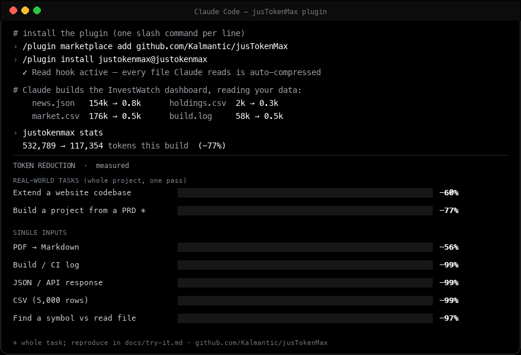

# jusTokenMax

**Keep your coding agent under a token (and cost) budget.** jusTokenMax shrinks
every expensive thing before it reaches the model's context — attachments, logs,
JSON, notebooks, CSVs, diffs, and the files you read — so the same work costs a
fraction of the tokens.

> Built by **Kashi** ([linkedin](https://www.linkedin.com/in/kashiks/)) and
> **Rajan** ([linkedin](https://www.linkedin.com/in/thiyagarajan/)), founders of
> [Kalmantic](https://www.kalmantic.com) — [jusCode.co](https://juscode.co).
> MIT licensed.

[](https://github.com/sponsors/Kashi-KS)

<p align="center">
  
</p>
<!-- terminal-demo.gif loops on GitHub; assets/terminal-demo.svg is the crisp (static) source. -->


---

## TokenMax under a budget

Coding-agent bills are driven by **input tokens** — the PDFs, logs, API
responses, diffs, and source files that pile into the context window. jusTokenMax
caps that: it intercepts each heavy input and replaces it with a faithful, far
cheaper equivalent, **before** it costs you a token.

- **Compress everything that bloats context** — PDFs → Markdown, images
  downscaled, logs/JSON/notebooks/CSVs/diffs digested, whole-file reads replaced
  by symbol lookups. Typical reductions **56%–99%** (measured, below).
- **Stay under a budget** — point it at the things you feed your agent and the
  per-task token cost drops by roughly the same amounts; pair with `terse`
  output and `chat-branch` to also cap what the agent *writes* and *re-reads*.
- **Reversible & safe** — every original is cached by content hash
  (`justokenmax retrieve` brings it back); secrets and base64 blobs are masked on
  the way through.
- **Works where you work** — **automatic** in Claude Code (a `Read` hook swaps
  heavy files for cheap artifacts in place), and available to **any MCP agent**
  (Codex CLI, OpenCode, Cursor, …) plus a plain `justokenmax` CLI.
- **Zero dependencies, fully auditable** — deterministic heuristics, no trained
  model, no network. Every transform is readable Python.

| What you feed it | Typical reduction |
| --- | ---: |
| PDF spec / paper | **−56%** (real PDFs) |
| Verbose build/CI log | **−99%** |
| Large JSON / API response | **−99%** |
| Jupyter notebook | **−99%** |
| CSV (thousands of rows) | **−99%** |
| Git diff (lockfile churn) | lockfile → 1 line |
| Finding a symbol vs reading the file | **−97%** |

---

## Quickstart — try it

Fastest path, **inside Claude Code** (run these one at a time — one slash command
per prompt):

1. `/plugin marketplace add https://github.com/Kalmantic/jusTokenMax.git`
2. `/plugin install justokenmax@justokenmax`
3. `/reload-plugins`

Now reading PDFs / logs / JSON / CSV / notebooks / diffs is compressed
automatically. (The hook calls the `justokenmax` CLI — see [Install](#install)
to add it; or just have Node and it auto-provisions.) Prefer the CLI or another
agent? `justokenmax install` registers it for Codex / OpenCode / Cursor too.

**👉 Full 5-minute hands-on with a real dev task and on/off measurement:
[`docs/try-it.md`](docs/try-it.md).**

> **In a real development loop** — one pass through a small website project's
> inputs (8 source modules, a 10k-line `package-lock.json`, a 5,000-row CSV, a
> noisy build log): **259,819 → 103,745 tokens (−60%)**, measured with a real
> tokenizer — and it compounds as the agent re-reads files while editing.
> Reproduce it step by step in [`docs/try-it.md`](docs/try-it.md).

---

## Built for casual users *and* enterprise — from day one

The same tool serves a solo developer and a regulated enterprise, by design — not
as an afterthought:

- **Casual users** get a one-command setup (`justokenmax install`) and then it
  just works, automatically: free, MIT, no account, no signup, sensible
  defaults. Your agent simply gets cheaper.
- **Enterprise** gets a tool that's safe to adopt: **zero third-party services
  and no network calls** — nothing leaves the machine, so it runs air-gapped and
  sidesteps data-egress / residency review; **deterministic and fully auditable**
  (readable Python, no black-box model) for security sign-off; **built-in secret
  redaction** (API keys/tokens masked before they ever reach context, logs, or
  the cache); an **owner-only (0700) local cache**; **reversible** (originals
  retained); **open-MCP-standard** integration that drops into an approved
  toolchain; and **MIT licensing** for legal clearance.

That's why it's deliberately zero-dependency and deterministic from the first
commit — the properties enterprises require are the same ones that keep it small
and trustworthy for everyone.

---

## Comparison

Inspired by headroom / caveman / codegraph, built independently. ✅ has it ·
⚠️ partial · ❌ no.

| Capability | jusTokenMax | headroom | caveman | codegraph |
|---|:--:|:--:|:--:|:--:|
| PDF → Markdown (drop page-image channel) | ✅ | ❌ | ❌ | ❌ |
| Image / log / JSON compression | ✅ | ✅ | ❌ | ❌ |
| **Notebook (.ipynb) compression** | ✅ | ❌ | ❌ | ❌ |
| **CSV / tabular sampling** | ✅ | ❌ | ❌ | ❌ |
| **Git-diff compression** | ✅ | ❌ | ❌ | ❌ |
| **Delta / incremental re-reads** | ✅ | ❌ | ❌ | ❌ |
| **Secret + base64-blob redaction** | ✅ | ❌ | ❌ | ❌ |
| Code symbol index + outline | ✅ | ❌ | ❌ | ✅ |
| Output-token reduction (terse) | ✅ | ✅ | ✅ | ❌ |
| Chat branching → subagent + digest | ✅ | ⚠️ | ❌ | ❌ |
| Reversible + retrieve original | ✅ | ✅ | ❌ | ❌ |
| Transparent in-place Read rewrite | ✅ | ❌ | ❌ | ⚠️ |
| Content sniffer / auto-route | ✅ | ✅ | ❌ | ❌ |
| MCP server + one-command install | ✅ | ⚠️ | ⚠️ | ⚠️ |
| **MCP compression proxy (any server)** | ✅ | ✅ | ❌ | ❌ |
| **Per-lever on/off config** | ✅ | ⚠️ | ⚠️ | ❌ |
| HTTP proxy / wrap / middleware | ❌ | ✅ | ❌ | ❌ |
| Trained compression model | ❌ | ✅ | ❌ | ❌ |
| Cross-agent shared memory | ❌ | ✅ | ❌ | ❌ |
| Zero-dependency / auditable | ✅ | ❌ | ✅ | ⚠️ |
| **Single unified plugin (all levers)** | ✅ | ⚠️ | ❌ | ❌ |

What's **distinct to jusTokenMax**: a Claude-Code-native transparent rewrite
(`updatedInput`, no proxy), a queryable code symbol index **+ file outline**, PDF
→ Markdown that eliminates the per-page image channel, chat-branching as a
first-class command, and fully transparent zero-dependency heuristics. What
headroom still has that we don't: a trained model, an HTTP proxy mode, and a
cross-agent shared-memory store.

---

## Install

The canonical install is the Python package; it provides the `justokenmax` CLI.

**From this repo (works today — Python 3.9+):**

```bash
git clone https://github.com/Kalmantic/jusTokenMax && cd jusTokenMax
pip install pypdf Pillow            # required codecs
pip install pdfplumber              # optional: better PDF table extraction
pip install ./python                # installs the `justokenmax` CLI
justokenmax --version
```

**From PyPI** (once published): `pip install justokenmax`.

**npm** (optional thin shim — runs `python -m justokenmax`, so it still needs the
Python package above): `npm install -g @kalmantic/justokenmax`.

**As a Claude Code plugin** — from inside Claude Code, run these **one at a time**
(one slash command per prompt — don't paste all three together):

1. `/plugin marketplace add https://github.com/Kalmantic/jusTokenMax.git`
2. `/plugin install justokenmax@justokenmax`
3. `/reload-plugins`

The `Read` hook then optimizes PDFs / images / logs / JSON / notebooks / CSV /
diffs automatically, and the commands, skills, and MCP server become available.
The hook calls the `justokenmax` CLI, so install the Python package (above) or
have Node (it auto-provisions via `npx`/`uv`).

To **uninstall** the plugin (one at a time):

1. `/plugin uninstall justokenmax@justokenmax`
2. `/plugin marketplace remove justokenmax`
3. `/reload-plugins`

**One-command setup for any agent** (seamless and reversible — idempotent,
never clobbers your other servers, removes cleanly):

```bash
justokenmax install              # auto-detect Codex / OpenCode / Cursor / Claude and register the MCP server
justokenmax install codex        # or target one agent
justokenmax install --dry-run    # preview the change first
justokenmax uninstall            # remove it again, just as cleanly
```

This writes the MCP-server entry into each agent's own config (`~/.codex/
config.toml`, `~/.config/opencode/opencode.json`, `~/.cursor/mcp.json`, project
`.mcp.json`). The registered command is `npx`, which works for **anyone with
Node — even with no Python installed**:

```toml
# Codex: ~/.codex/config.toml
[mcp_servers.justokenmax]
command = "npx"
args = ["-y", "@kalmantic/justokenmax", "mcp"]
```

**Node but no Python?** The `npx` launcher auto-provisions a runtime: if no
Python is on `PATH` it falls back to **`uvx justokenmax`** ([uv](https://astral.sh/uv)
fetches an ephemeral Python + the package), and bootstraps `uv` itself if
needed. So a Claude Code user with only Node gets the full MCP toolset with zero
manual setup. (If you do have Python, `command = "python3"`, `args = ["-m",
"justokenmax.mcp_server"]` works too and skips Node entirely.)

**OpenCode** also has a transparent read-compression plugin (mirrors the Claude
Code hook) — see [`integrations/opencode/`](integrations/opencode/).

---

## The levers

| Module | Reduces | How | Measured |
| --- | --- | --- | --- |
| **Attachments** | PDFs & images you read | PDF → page-delimited Markdown (drops the per-page image channel); images downscaled ≤1568px + recompressed | **−56%** on real PDFs |
| **Logs** | verbose build/test/CI output | strip ANSI, collapse repeats (`×N`), fold stack traces, keep errors/warnings + head/tail | **−99%** |
| **JSON / tool output** | big structured payloads | sample long arrays, truncate long strings, cap depth, minify whitespace; large uniform object arrays collapse to one inferred schema (`[N × {id:int, name:str, …}]`) | **−99%** |
| **Lockfiles** | `package-lock.json`, `yarn.lock`, `pnpm-lock.yaml`, `poetry.lock`, `Cargo.lock`, `Gemfile.lock` | collapse to a `name@version` table; drop integrity hashes + resolved URLs | **−99%** |
| **Minified assets** | `.min.js` / `.min.css` & single-line packed blobs | stub to one line (`<minified asset, N bytes — retrieve for source>`) | **−99%** |
| **Notebooks** | `.ipynb` files | drop base64 image outputs, truncate cell outputs, keep code + markdown | **−99%** |
| **CSV / tabular** | large tables | header + inferred column types + sample rows + row count | **−99%** |
| **Git diffs** | lockfile/generated churn | keep code hunks, collapse lockfile/generated/minified file diffs to one line | lockfile → 1 line |
| **Delta reads** | re-reading the same file | return only the diff since the last read, not the whole file | **−96%** |
| **Redaction** | secrets & blobs in text | mask API keys/tokens/passwords, elide base64/data-URIs (tokens **+** safety) | safety + tokens |
| **Code index + outline** | reading whole files to find code | symbol map (`file:line` + signature) + file outlines so you read only the relevant range | **−97%** to locate a symbol |
| **Terse output** | tokens the agent *writes* | output-style steering: lead with answer, fragments, no filler — facts kept exact | output-side |
| **Chat branching** | sub-tasks that bloat the thread | offload heavy work to an isolated subagent context, merge back only a digest | workflow skill |
| **Cache alignment** | recompute on long sessions | keep the prompt prefix stable so the provider KV cache keeps hitting | guidance |

All compression is **reversible** — originals are cached by content hash and
`justokenmax retrieve <artifact>` hands the full version back — and tracked in a
lifetime ledger (`justokenmax stats`). A content **sniffer** routes generic files
(`.txt`/`.out`/no-extension) to the right compressor automatically.

## How each lever works

**Attachments.** A PDF is billed as *text + a rendered page-image* (~1,500
tokens/page after the API clamps a page to ≤1.15MP). jusTokenMax extracts the
text to clean Markdown and **drops the image channel** — you keep the words,
stop paying for the picture, and gain something searchable and quotable. Images
are downscaled to the model's resolution ceiling and recompressed.

*Why text, not image parsing?* Almost every spec, design doc, README, and test
document an agent reads is **born digital with a real text layer** — and text is
~10× cheaper than a page-image, plus searchable, quotable, and diffable. So
text-first extraction is the right default; the only case it can't serve is a
**scanned/image-only** PDF (no text layer), which is exactly where OCR comes in
(on the roadmap). And if you'd rather it never touch PDFs, `justokenmax config
disable pdf`.

**Logs.** Build/test/CI output is mostly noise: ANSI codes, progress spam, the
same line hundreds of times, 50-frame stack traces. jusTokenMax digests it —
strips colour, collapses repeated lines into `(×N)`, folds long traces to
first+last frame, and always keeps error/warning lines plus the head and tail.

**Code index + outline.** Reading entire files to find one function is the
biggest avoidable input cost. jusTokenMax parses the repo (Python via `ast`,
JS/TS/Java via brace-aware scanners, others via regex) into a symbol map, so
`justokenmax query parse_config` returns `file:line` + a full signature, and
`justokenmax outline <file>` returns a file's shape with no bodies.

**Chat branching.** Every file read stays in context for the rest of the
session. Branching runs a self-contained sub-task in a subagent whose context is
discarded afterward, returning only a compact digest.

## Results

Measured by [`benchmarks/benchmark.py`](benchmarks/benchmark.py). Text is counted
with a real tokenizer (tiktoken / `cl100k`); the PDF "before" uses the page-image
model at a conservative ~1,500 tokens/page. Full detail (regenerable) in
[`benchmarks/RESULTS.md`](benchmarks/RESULTS.md).

**PDF → Markdown** (real public PDFs)

| Document | Pages | Before | After | Reduction |
| --- | ---: | ---: | ---: | ---: |
| *Attention Is All You Need* (arXiv 1706.03762) | 15 | 37,074 | 14,574 | **−60%** |
| IRS Form W-9 | 6 | 18,305 | 9,305 | **−49%** |
| **Total** | 21 | **55,379** | **23,879** | **−56%** |

**Logs / JSON / Notebook / CSV / delta**

| Input | Tokens before | Tokens after | Reduction |
| --- | ---: | ---: | ---: |
| build log (4,345 → 21 lines) | 107,668 | 396 | **−99%** |
| API response (2,000-row payload) | 168,023 | 374 | **−99%** |
| notebook, 20 cells w/ image outputs | 401,170 | 610 | **−99%** |
| CSV, 5,000 rows | 57,340 | 237 | **−99%** |
| delta re-read, 1 edit in 600 lines | 2,407 | 88 | **−96%** |

**Code index** — locating a symbol vs reading the file, over 21 lookups in
jusTokenMax's own source: **16,691 → 486 tokens (−97%)**. **Images** — 3000×2000
→ 1568×1045, 186 KB → 107 KB (**−42% bytes**).

**A real development loop** — one pass through a small website project's inputs
(reproduce with the scaffold in [`docs/try-it.md`](docs/try-it.md)):

| Input the agent reads | Tokens before | After | Reduction |
| --- | ---: | ---: | ---: |
| 8 source modules (read whole → outline) | 872 | 520 | −40% |
| `package-lock.json` | 126,426 | 102,414 | −18% |
| `products.csv` (5,000 rows) | 82,506 | 290 | −99% |
| `build.log` | 50,015 | 521 | −98% |
| **Total (one pass)** | **259,819** | **103,745** | **−60%** |

(The source-module saving is small here only because the demo modules are tiny;
on real files it's much larger — and every **re-read** during editing is near-free
via delta.)

**A build-from-scratch project** — hand your agent a PRD for a news-indexed
investment tracker and it ingests a news-feed JSON, holdings + market-history
CSVs, a lockfile, and build logs: **532,789 → 117,354 tokens (−77%)** on the data
it reads (the PRD itself is untouched). Full worked example — a real
[PRD](examples/investment-tracker/PRD.md), a `scaffold.sh`, and a **built
reference app** ([`examples/investment-tracker/app/`](examples/investment-tracker/app/index.html),
vanilla HTML/CSS/JS, no build step) you can run.

Reproduce the benchmarks: `python benchmarks/benchmark.py --fetch`; reproduce the
dev loops: [`docs/try-it.md`](docs/try-it.md) and the example above.

## Use

```bash
justokenmax optimize report.pdf shot.png build.log api.json data.csv nb.ipynb  # by type
justokenmax logs ci-output.log                      # compress a verbose log
justokenmax json response.json                      # compress a JSON payload
justokenmax delta src/app.py                        # only what changed since last read
justokenmax redact secrets.txt                      # mask secrets + elide blobs
justokenmax index && justokenmax query parse_config # build index, find a symbol
justokenmax retrieve <artifact>                     # get the original back (reversible)
justokenmax stats                                   # lifetime token savings
justokenmax sessions                                # per-session savings (effectiveness over time)
justokenmax install / uninstall [agent]             # register/remove the MCP server for any agent
justokenmax config disable csv                      # turn a lever off (your project, your way)
justokenmax proxy -- npx -y some-mcp-server         # compress ANY other MCP server's output
```

New here? **[`docs/try-it.md`](docs/try-it.md)** is a 5-minute, copy-paste
walkthrough that shows the savings with a lever on vs off.

### Configure — optimize your way

Every lever is on by default; turn any of them off when a project needs the raw
file:

```bash
justokenmax config                    # show what's on/off
justokenmax config disable pdf        # persist: skip PDFs from now on
justokenmax config enable pdf         # back on
JUSTOKENMAX_DISABLE=pdf,image justokenmax optimize x.pdf   # one-off, via env
```

Kinds: `pdf image log json notebook csv diff redact`. A disabled kind is skipped
by `optimize()` and left untouched by the Read hook.

### Plugin surface

- **Hook:** `PreToolUse(Read)` transparently rewrites a `Read` of a PDF / image /
  `.log` / JSON / `.ipynb` / CSV / diff to the cheap artifact via `updatedInput`.
  It **never blocks a Read** — any failure falls through untouched.
- **MCP server:** `.mcp.json` launches a stdlib stdio server exposing
  `justokenmax_optimize`, `_compress_json`, `_compress_log`, `_compress_diff`,
  `_query`, `_outline`, `_delta`, `_redact`, `_retrieve`, `_stats` — so **any**
  MCP-capable agent can call it.
- **Commands:** `/justokenmax:optimize|logs|json|diff|index|query|outline|delta|redact|retrieve|terse|branch|compress-memory|learn|stats`.
- **Skills:** `attachments`, `code-index`, `chat-branch`, `terse-output`,
  `cache-align`.

## Limits & honesty

- **No OCR.** Scanned / image-only PDFs have no text layer → empty Markdown;
  jusTokenMax detects no saving and passes the original through.
- **PDF per-page tokens are a conservative model**, not a billed number.
- **Image token savings are base64-pipeline only** (native vision downscales
  regardless); the always-real image win is bytes.
- **The code index is a snapshot**, not live — re-run `justokenmax index` after
  big changes.

## Safety

Hooks run on untrusted files, so the converters are bounded: PDFs capped at
2,000 pages / ~5M chars of output, Pillow's decompression-bomb guard kept active,
no shell execution, output paths are content-hash names, and the Read hook fails
open. Secrets and base64 blobs are masked inside every text digest.

## Test

```bash
cd python && pip install -e . pytest pdfplumber
pytest -q      # pdf, image, log, json, notebook, csv, diff, delta, redact, code-index, outline, optimize, cli, hook, mcp
```

## Results — measured savings

All numbers are measured (text via a real tokenizer, tiktoken `cl100k`) and
reproducible — nothing here is hand-waved.

**Real-world tasks first** — whole-project, one pass; reproduce step by step in
the linked docs:

| Scenario | Before | After | Reduction |
| --- | ---: | ---: | ---: |
| [Extend an existing website codebase](docs/try-it.md) | 259,819 | 103,745 | **−60%** |
| [Build a project from a PRD — InvestWatch](examples/investment-tracker/PRD.md) (data inputs) | 532,789 | 117,354 | **−77%** |

The InvestWatch example ships a **runnable reference app**
([`examples/investment-tracker/app/`](examples/investment-tracker/app/index.html)).
Both numbers are *one pass* — in a real session they compound as the agent
re-reads files (near-free via delta).

**Single inputs** — reproduce with `python benchmarks/benchmark.py --fetch`:

| Input | Reduction |
| --- | ---: |
| PDF → Markdown (real public PDFs) | **−56%** |
| Verbose build / CI log | **−99%** |
| Large JSON / API response | **−99%** |
| Jupyter notebook | **−99%** |
| CSV (5,000 rows) | **−99%** |
| Locate a symbol vs read the whole file | **−97%** |
| Image | −42% bytes |

## Support this project

jusTokenMax is free and MIT-licensed. If it keeps your agent under budget, please
consider **[sponsoring on GitHub](https://github.com/sponsors/Kashi-KS)** — it
funds OCR, more languages, and the roadmap. Thank you 🙏

## Roadmap

OCR for scanned PDFs, DOCX/PPTX/HTML inputs, even deeper multi-language parsing, a
diff-mode lockfile path, a `learn` loop that mines sessions for durable
corrections, and PyPI/npm publishing. (Cross-agent `install`/`uninstall`, the
OpenCode plugin, and the MCP compression proxy are **done**.) PRs welcome.
